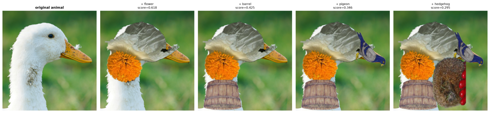
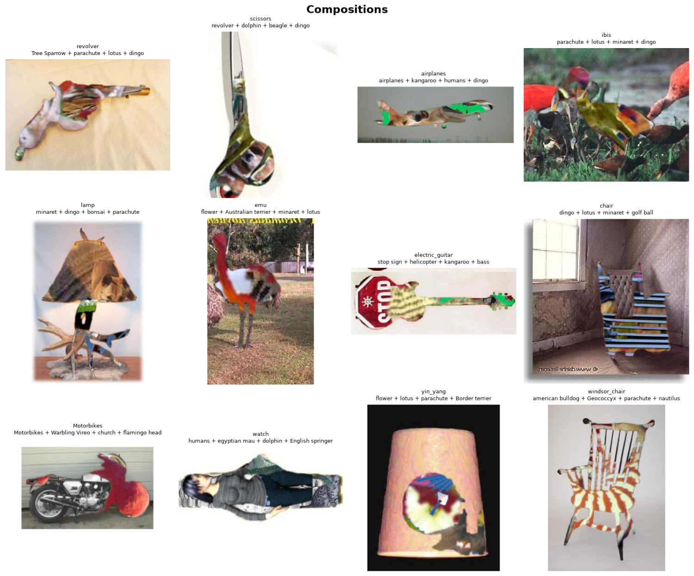

# image_composer

Build an animal out of photographs of other objects.



The photo is the canvas. Each round, every object in a pool is scored against
the canvas's contours and the best-fitting one is composited on top — whole, not
cut to the outline underneath. Objects run past the edge they were matched to,
and that overhang is the point: the subject still reads, but the seams show.

It does not have to be an animal. A revolver built from a tree sparrow, a
guitar whose body is a stop sign, a Windsor chair striped out of a bulldog:



## Install

```bash
pip install -r requirements.txt
```

`rembg` downloads its ~180 MB segmentation model on first use.

## Compose an animal

```bash
python compose_animal.py --animal image_patches/duck3.png --rounds 4
```

Useful flags:

| flag | meaning |
| --- | --- |
| `--rounds N` | how many objects to lay onto the animal |
| `--sources a,b,c` | which image databases to draw objects from |
| `--num-objects N` | size of the object pool to search |
| `--min-body-frac F` | each object must cover this much of the animal (keeps objects legible) |
| `--max-overlap F` | reject a placement that buries this much of itself in earlier objects |
| `--min-score F` | stop early rather than paste something that does not fit |
| `--rank-top-k N` | objects promoted from coarse ranking to full-resolution matching |

## Many images at once

`make_gallery.py` composes a batch against one shared object pool. Loading and
segmenting the pool is the slow half of a run, so doing it once instead of once
per image makes each extra picture cost only its own rounds.

```bash
python make_gallery.py --count 12 --rounds 4 --num-objects 900
python make_gallery.py --canvas a.jpg --canvas b.jpg --rounds 3
```

With no `--canvas` it picks canvases from Caltech101 by silhouette quality —
subject fills a reasonable part of the frame, is the only thing in it, and has
an outline with some structure — so the batch is not full of images the
segmenter could not cut. It writes each composition plus a contact sheet.

## Search the other direction

`search_targets.py` takes patches from a folder and finds dataset images they
composite convincingly *onto* — the workflow that puts a duck's head on a
sailboat. Click any cell in the result grid to save that composite.

```bash
python search_targets.py --patch-dir image_patches --source caltech101
```

`autosearchcaltch.py` and `auto_search_imagenet.py` are presets over it, for
Caltech101 and ImageNet respectively.

## Image sources

Objects come from datasets of *single subjects on plain backgrounds*, because
that is what a background remover can cut cleanly; a cluttered scene segments
into an unusable blob. Archives download once into
`~/.cache/image_composer/datasets`.

| `--source` | contents | size |
| --- | --- | --- |
| `caltech101` | 9k photos, 101 object categories — best all-round source | 126 MB |
| `flowers102` | 8k single flowers, very clean separation | 329 MB |
| `imagenette` | 13k photos, 10 easily-separable ImageNet classes | 326 MB |
| `imagewoof` | 13k dog photos across 10 breeds | 328 MB |
| `figures` | 1k rendered humans and horses on plain white | 142 MB |
| `hands` | 2.5k rendered hands on plain white | 191 MB |
| `pets` | 7k cat and dog portraits | 774 MB |
| `birds` | 12k birds (CUB-200) | 1.1 GB |
| `cars` | 16k cars, strong silhouettes | 1.9 GB |
| `imagenet` | ImageNet-1k streamed from HuggingFace | — |
| `folder` | any local directory, via `--folder` | — |

`figures` and `hands` are rendered on flat white, so they cut perfectly and
contribute articulated and long thin silhouettes that the photo sets mostly
lack. Pool *size* matters as much as variety — the matcher takes the best fit
it can find, so more candidates means closer fits.

`imagenet` needs network access to `huggingface.co`; the rest come from S3
mirrors. Unreachable sources are skipped with a warning rather than aborting
the run, so a machine behind a restrictive proxy still gets a full pool.

## How the matching works

Placements are scored by a symmetric chamfer match between the object's
silhouette and the animal's contours, combining three terms:

- **precision** — do the object's edges land on the animal's edges?
- **recall** — how much of the animal's whole contour does this placement
  explain? Without this, the score is maximised by shrinking an object to a
  few pixels, which sits perfectly on any contour.
- **containment** — how much of the object's body lands inside the animal?

Objects already placed are recorded in an occupancy mask, which both penalises
and hard-limits overlap, so later rounds spread across the animal instead of
burying earlier ones.

A run searches the pool in two stages: every object is ranked at coarse
resolution, and only the best `--rank-top-k` are re-matched at full
resolution. Ranking an object is ~15× cheaper than matching it, so the pool
can grow without the round time following it.

## Layout

```
composer/
  segment.py      background removal, outlines, mask cache
  geometry.py     resizing, flip/rotate variants, transform replay
  matching.py     chamfer scoring, coarse-to-fine search
  compositing.py  pasting a cut-out onto a canvas
  sources.py      pluggable image databases
  pipeline.py     segmenting an object pool
  search.py       the patch-to-target direction
  cache.py        on-disk mask cache
compose_animal.py   build an animal out of objects
make_gallery.py     compose a batch against one shared pool
search_targets.py   find images a patch composites onto
```
